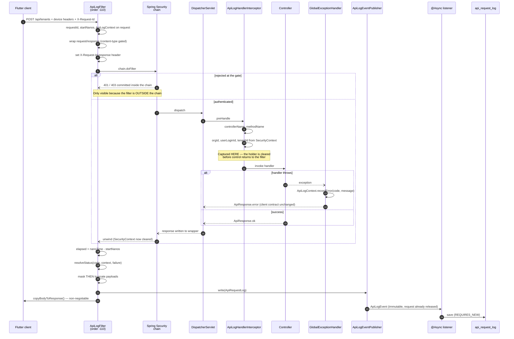

# API Request Logging Framework

Centralised capture of every incoming API request and outgoing response, with zero logging code in
controllers or services. Package: `com.pgmanager.apilog`. Table: `api_request_log` (Flyway `V30`).

---

## 1. Architecture, and why this combination

No single Spring extension point can see everything a complete log row needs. Each candidate is
blind to something:

| Component | Sees | Cannot see |
|---|---|---|
| `OncePerRequestFilter` (outside the security chain) | raw bytes, total wall-clock time, **401/403 produced by Spring Security** | the resolved handler; the authenticated principal (context already cleared) |
| `HandlerInterceptor` | resolved `HandlerMethod`, live `SecurityContext` | requests rejected before dispatch; the response body |
| `@RestControllerAdvice` | the exception, its type and message | timing, payloads, anything about requests that did not throw |

So the framework uses all three, with **request attributes** as the only shared state.

```
Filter (order -110)  ──►  Spring Security chain  ──►  DispatcherServlet  ──►  Interceptor  ──►  Controller
     │                                                                            │              │
     │ starts clock, wraps req/res                        identity + handler ──────┘              │
     │                                                                                            │
     │ ◄──────────────── 401/403 short-circuit ───────────────────────────────  advice ◄───────────┘
     │                                                                       (errorCode/message)
     └──► assembles ONE row ──► ApiLogWriter ──► event ──► @Async listener ──► repository
```

### The three decisions that matter

**1. The filter sits *outside* the Spring Security chain (`order = DEFAULT_FILTER_ORDER - 10`).**
A 401 from the authentication entry point and a 403 from an authorization decision are written and
committed *inside* the security chain. A filter registered after it never runs for those requests —
so the `UNAUTHORIZED` and `FORBIDDEN` statuses would not exist, and rejected traffic (the traffic
you most want on record) would be invisible.

**2. Identity is captured in the interceptor, not the filter.**
This is the subtle one, and the bug most implementations ship. Reading
`SecurityContextHolder` in the filter *after* `chain.doFilter()` returns yields `null` on every
single request: Spring Security's `SecurityContextHolderFilter` clears the holder in its own
`finally`, which runs before control unwinds to a filter placed outside the chain. Identity must be
snapshotted while the dispatch is still in flight — `preHandle` is that moment.

**3. Shared state is a request attribute, never a `ThreadLocal`.**
A `ThreadLocal` is the reflexive choice and it is wrong twice over. Spring MVC async dispatch
resumes on a *different* thread, so a value set in `preHandle` is invisible when the filter
finishes. Worse, a missed `remove()` on a pooled container thread leaks the previous caller's
`organizationId` into the next request — a cross-tenant data bug in a multi-tenant application.
A request attribute is bound to the `HttpServletRequest`: it survives the async hop, dies with the
request, and needs no cleanup.

### Write path: Spring events + a dedicated `@Async` executor

The filter depends only on the `ApiLogWriter` interface — not on events, executors or repositories.
That is Dependency Inversion doing real work: the filter is unit-testable with a list-collecting
stub (43 tests, no Spring context, no database), and the delivery mechanism can be swapped without
reopening capture logic. The default implementation publishes an `ApiLogEvent`; an `@Async`
`@EventListener` persists it. Adding a metrics counter or an Elasticsearch shipper is a new
listener, with no edit to the filter — Open/Closed where it actually pays off.

**Pool sizing is a lossless-vs-latency decision.** The requirement is every hit persisted, no
sampling. That rules out a discard policy. An unbounded queue is the other common answer and it is
worse: under sustained burst it grows until the heap dies, taking the application with it. So the
queue is bounded (10,000) and overflow uses `CallerRunsPolicy` — when the pool saturates, the
request thread does the insert itself. Deliberate backpressure: requests slow, the queue drains,
nothing is lost. Slow beats silently incomplete for an audit trail. Shutdown drains the queue
(`setWaitForTasksToCompleteOnShutdown`) so a rolling deploy does not discard the last seconds of
traffic.

---

## 2. Folder structure

```
backend/src/main/java/com/pgmanager/apilog/
├── ApiRequestLog.java              # JPA entity (32 columns)
├── ApiRequestLogRepository.java    # JpaRepository + batched retention delete
├── ApiLogStatus.java               # SUCCESS|FAILED|EXCEPTION|UNAUTHORIZED|FORBIDDEN|TIMEOUT
├── ApiLogProperties.java           # @ConfigurationProperties("logging.api")
├── ApiLogConfig.java               # @EnableConfigurationProperties
├── ApiLogContext.java              # per-request shared state (request attribute)
├── ApiLogFilter.java               # OncePerRequestFilter — orchestrator, order -110
├── ApiLogRequestWrapper.java       # ContentCachingRequestWrapper + "should I buffer?" policy
├── ApiLogResponseWrapper.java      # ContentCachingResponseWrapper + copyBodyToResponse contract
├── ApiLogHandlerInterceptor.java   # identity + controller/method capture
├── ApiLogWebMvcConfig.java         # registers the interceptor for /**
├── ApiLogWriter.java               # the seam: one method, no infrastructure
├── ApiLogEvent.java                # immutable envelope
├── ApiLogEventPublisher.java       # default ApiLogWriter
├── ApiLogEventListener.java        # @Async boundary
├── ApiLogPersistenceService.java   # the only save, REQUIRES_NEW
├── ApiLogAsyncConfig.java          # @EnableAsync + bounded pool (conditional)
├── ApiLogCleanupScheduler.java     # @Scheduled batched retention purge
├── SensitiveDataMasker.java        # reusable masking utility
└── ApiLogDemoController.java       # sample API + support lookup

backend/src/main/resources/db/migration/V30__api_request_log.sql
backend/src/test/java/com/pgmanager/apilog/    # 5 test classes, 43 tests

Touched outside the package (one hook, six lines):
└── common/exception/GlobalExceptionHandler.java   # record(req, ex, message)
```

---

## 3. Sequence diagram



---

## 4. End-to-end request flow

1. **Filter entry.** Resolve `requestId` (client `X-Request-Id`, else a UUID), stamp
   `System.nanoTime()`, attach `ApiLogContext` to the request, echo `X-Request-Id` back so a user
   can quote it off a failure screen.
2. **Wrap.** Request and response are wrapped only if body storage is on. Content type decides
   whether the body is *buffered*: JSON/form/text yes; multipart CSV upload, PDF, octet-stream no —
   those log the hit with a placeholder rather than pulling 40 MB into heap.
3. **Security chain.** If the request is rejected, the response is committed here and control
   returns straight to the filter's `finally` — the row is still written, as `UNAUTHORIZED` or
   `FORBIDDEN`.
4. **`preHandle`.** `controllerName`, `methodName`, and `organizationId`/`userLoginId`/`tenantId`
   are copied onto the context. Anonymous traffic leaves all three null.
5. **Handler.** Ordinary controller code. It contains no logging, no timing, no try/catch for audit.
6. **On exception.** `GlobalExceptionHandler` converts it to the standard `ApiResponse` envelope
   *and* calls `ApiLogContext.recordError(...)`. The client contract is unchanged; the row gains
   `errorCode` (exception simple name) and `errorMessage`, and is classified `EXCEPTION`.
7. **Filter `finally`.** Compute elapsed ms from the monotonic clock, resolve status, mask then
   truncate every payload, build the entity, hand it to `ApiLogWriter`.
8. **`copyBodyToResponse()`.** Always, in a nested `finally`. Skipping it ships an empty body to
   every caller — the classic way this pattern silently breaks an entire API.
9. **Async persist.** Event → `@Async` listener → `save` in its own transaction, so a rolled-back
   business transaction cannot discard the log of the request that failed.
10. **Retention.** `ApiLogCleanupScheduler` runs at 03:15 and deletes in bounded batches until a
    short batch signals the tail.

### Status derivation (precedence order)

| # | Condition | Status |
|---|---|---|
| 1 | HTTP 401 | `UNAUTHORIZED` |
| 2 | HTTP 403 | `FORBIDDEN` |
| 3 | HTTP 504 or `AsyncRequestTimeoutException` | `TIMEOUT` |
| 4 | advice recorded an exception | `EXCEPTION` |
| 5 | status ≥ 400 | `FAILED` |
| 6 | otherwise | `SUCCESS` |

401/403 outrank `EXCEPTION` deliberately: an `AccessDeniedException` surfacing as 403 is more
useful filed as `FORBIDDEN`. `FAILED` is reserved for error statuses that did **not** come from a
thrown exception — an unmapped 404, or a controller that chose to return 4xx.

---

## 5. Sensitive data masking

`SensitiveDataMasker` is stateless (one shared bean, thread-safe) and matches **by key, not by
value pattern**. Keys are normalised — lowercased with every non-alphanumeric character dropped —
so `confirmPassword`, `confirm_password`, `Confirm-Password` and `CONFIRMPASSWORD` all collapse to
one entry. A regex-per-field list misses the casing variant nobody thought of.

- **JSON** is masked *structurally* (parse → walk → re-serialise), so stored rows stay valid JSON
  and stay queryable.
- **Non-parseable text** falls back to regex. Order matters: quoted JSON pairs, then unquoted
  `key=value`, then bare `Bearer <token>`. Running the bare-token pattern first would leave the key
  pattern to mask the literal word "Bearer" and produce a double mask.
- **Headers** are masked by name (`Authorization`, `Cookie`). Device headers are *not* masked —
  they are the point of capturing headers.
- **Query strings** are masked per parameter.

**Mask first, truncate second.** The reverse order is a real leak: cutting JSON mid-document makes
it unparseable, the structural masker bails out, and the surviving tail can still hold a raw secret.

Deliberately **no value-pattern matching** for `creditCardNumber` / `aadhaarNumber`. A "12+ digit
run" rule would also redact invoice totals, mobile numbers and ids, making the logs useless for the
debugging they exist for. Covered by a regression test (`leavesNonSensitiveNumbersAlone`).

Covered keys: `password`, `confirmPassword`, `currentPassword`, `newPassword`, `oldPassword`,
`passwordHash`, `otp`, `authorization`, `accessToken`, `refreshToken`, `token`, `upiPin`, `pin`,
`cvv`, `creditCardNumber`, `cardNumber`, `aadhaarNumber`, `aadhaar`, `cookie`, `setCookie`,
`secret`, `clientSecret`, `apiKey`, `jwtSecret`.

---

## 6. Indexes and the rationale

`V30` creates eight indexes. Two are composite rather than the single-column form requested, because
the single-column version would not be used:

| Index | Columns | Why |
|---|---|---|
| `idx_arl_created_date` | `created_date` | The retention sweep. The one index that must exist. |
| `idx_arl_org_created` | `organization_id, created_date` | "This org's traffic yesterday". A lone `organization_id` index is near-useless — low cardinality, and the planner would still filter the date range row by row. |
| `idx_arl_user_created` | `user_login_id, created_date` | "What did this user do this morning". Same reasoning. |
| `idx_arl_request_uri` | `request_uri` | Endpoint-level analysis: slowest / most-hit URIs. |
| `idx_arl_status` | `status` | Error triage. Low cardinality, but selective for the rare values (`EXCEPTION`) anyone searches for. |
| `idx_arl_response_status_code` | `response_status_code` | Same, for 500s. |
| `idx_arl_app_version` | `app_version` | "Is the crash only on build 42?" — per-release failure rates. |
| `idx_arl_request_id` | `request_id` | Support flow: user quotes the id from the response header. |

**No foreign keys** to `facility` / `user_login`. This table is append-only diagnostic data written
on every request, including for principals that may later be deleted; an FK would add a lock and a
lookup to the hottest insert path and could block a legitimate delete elsewhere.

**A `BIGINT` identity column, not a UUID.** Highest-insert-rate table in the schema; the primary-key index clusters on
the primary key, so a monotonic key appends to the rightmost page while a random UUID scatters
inserts across the index, causing page splits, a larger index and a worse buffer-pool hit rate.

---

## 7. Configuration

```yaml
logging:
  api:
    enabled: true                  # master switch; false = filter + interceptor short-circuit
    store-request-body: true       # false also stops the request being buffered
    store-response-body: true      # false also stops the response being buffered
    mask-sensitive-data: true      # leave on — off means plaintext secrets in the DB
    async: true                    # false = inline save (no @EnableAsync registered at all)
    retention-days: 10
    max-payload-chars: 8000        # applied AFTER masking
    cleanup-cron: "0 15 3 * * *"   # off-peak, clear of the 01:00 invoice sweep
    cleanup-batch-size: 5000
    cleanup-max-batches-per-run: 200
    executor:
      core-size: 2
      max-size: 8
      queue-capacity: 10000        # bounded: overflow → CallerRunsPolicy, never discard
      await-termination-seconds: 20
```

Every key has an environment-variable override (`API_LOG_ENABLED`, `API_LOG_RETENTION_DAYS`, …).

`async: false` works by making the whole `@EnableAsync` registration conditional, so `@Async` on the
listener is simply inert and the save runs inline. One annotation, no duplicated code path.

---

## 8. Best practices applied

**Never let logging change behaviour.** Every failure path swallows and logs: the publisher, the
persistence service, and the filter's assembly block. An unhandled exception is logged and then
**rethrown untouched**, so the client still gets the original error. Asserted by
`logsThenRethrowsAnUnhandledException`.

**Extract on the request thread, always.** The entity is fully built before it leaves the filter.
Touching the `HttpServletRequest` from the async thread would be a use-after-free — containers
recycle request objects the instant the response completes, so the `organizationId` read there may
belong to the *next* caller. This is the single most important rule in the design.

**`REQUIRES_NEW` for the log transaction.** A rolled-back business transaction must not discard the
log of the request that failed — that is the row you most want.

**Batch the retention delete.** Ten days at "log every hit" volume is millions of rows. One
`DELETE` would hold a huge transaction, bloat the undo log, lock a wide range of the `created_date`
index and ship as one enormous binlog event. Batched deletes keep every transaction short and let
normal traffic interleave. `cleanup-max-batches-per-run` stops one run hammering the database all
night; the next run continues where it stopped.

**Avoid self-invocation on `@Transactional`.** The batch delete is annotated on the *repository*
method. Annotating a method of the scheduler and calling it from `purgeExpiredLogs()` would be
self-invocation: the call never leaves the object, the proxy is bypassed, and the annotation
silently does nothing.

**Guard the read side.** Log rows carry request and response payloads across every organization.
The lookup endpoint lives under `/api/super-admin/**` — not `/api/api-logs/**`, because
`SecurityConfig`'s generic `/api/**` rule grants OWNER/MANAGER/… and *excludes* SUPER_ADMIN, so a
super-admin-only endpoint there would be unreachable by the one role meant to use it.

**Truncate inside the budget.** The `...[truncated]` marker is written *within* `max-payload-chars`,
not appended past it — appending would push a value over the column length and turn a logging
concern into a failed insert.

**Never create a session.** `request.getSession(false)`. The app is `STATELESS` and a logger that
quietly starts creating sessions would change that. Asserted by `neverCreatesAnHttpSession`.

### Known limits / operational notes

- **Volume.** Every hit, no sampling, means roughly one row per API call. Watch table growth for the
  first week and tune `retention-days` or narrow `max-payload-chars` before the disk decides for you.
- **Multi-instance cleanup.** `@Scheduled` runs on every node. The batched delete is idempotent so
  concurrent runs are harmless (they race to remove the same rows); if that ever matters, add
  ShedLock rather than switching cleanup off.
- **`sessionId` is normally null** — the app is stateless, so no session exists to report.
- **`tenantId` is only set for TENANT logins.** A "tenant" here is a resident party, so `partyId`
  doubles as `tenantId` only for that role; setting it for an owner would make the column mean two
  different things.

---

## 9. Tests (43, all passing, no Docker required)

| Class | Tests | Covers |
|---|---|---|
| `SensitiveDataMaskerTest` | 12 | key/nested/array masking, all naming conventions, structural JSON preservation, malformed-JSON fallback, bearer tokens, headers, query strings, the non-sensitive-numbers regression, null safety |
| `ApiLogFilterTest` | 18 | one row per request, device headers, request-id echo, masking, response capture *and* delivery, every status mapping, rethrow-after-log, multipart skip, oversize skip vs truncate, XFF parsing, all four config switches, no-session |
| `ApiLogEndToEndTest` | 7 | filter + interceptor + advice through a real dispatch: handler names, identity, tenant-only tenantId, anonymous nulls, exception details with the client contract intact, exactly-once |
| `ApiLogCleanupSchedulerTest` | 5 | retention window, loop-until-short-batch, batch ceiling, disabled, refuses `retention-days: 0` |
| `ApiRequestLogSchemaTest` | 1 | runs the baseline migration on a real PostgreSQL via Testcontainers, compares columns to the entity **by reflection**, asserts all 8 indexes, and executes the batched-delete `ctid IN (SELECT … LIMIT …)` form for real. Auto-skips without Docker. |

Run: `./gradlew test --tests "com.pgmanager.apilog.*"`

### Trying it by hand

```bash
# Happy path — the persisted request_body shows ***MASKED*** for password/otp
curl -i -X POST http://localhost:8080/api/api-logs/demo/echo \
  -H 'Authorization: Bearer <owner-token>' -H 'Content-Type: application/json' \
  -H 'App-Version: 1.4.2' -H 'Platform: android' -H 'Device-Model: Pixel 7' \
  -H 'X-Request-Id: manual-test-1' \
  -d '{"username":"owner","password":"hunter2","otp":"445566"}'

# Exception path — row is EXCEPTION with errorCode=BadRequestException, client still gets its 400
curl -i http://localhost:8080/api/api-logs/demo/boom -H 'Authorization: Bearer <owner-token>'

# Unauthenticated — row is UNAUTHORIZED, proving the filter sits outside the security chain
curl -i http://localhost:8080/api/tenants
```

```sql
SELECT request_uri, status, response_status_code, execution_time_ms,
       app_version, error_code, request_body
FROM api_request_log ORDER BY id DESC LIMIT 10;
```
